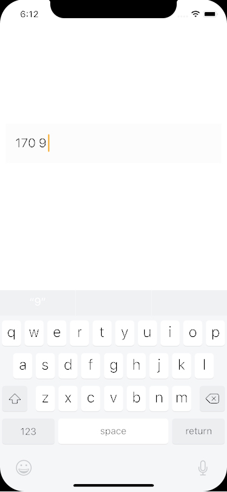

[](https://travis-ci.org/pcjbird/QuickMobileTextField)
[](http://cocoadocs.org/docsets/QuickMobileTextField/)
[](http://cocoadocs.org/docsets/QuickMobileTextField/)
[](https://www.apache.org/licenses/LICENSE-2.0.html)
[](https://github.com/pcjbird/QuickMobileTextField)
[](https://github.com/pcjbird/QuickMobileTextField/releases)


# QuickMobileTextField
### A Chinese mainland area mobile phone number input textfield. 中国大陆地区手机号码输入文本框。
 
 
 ## 演示 / Demo
 
 <p align="center"></p>
 
 
##  安装 / Installation

方法一：`QuickMobileTextField` is available through CocoaPods. To install it, simply add the following line to your Podfile:

```
pod 'QuickMobileTextField'
```
  
## 使用 / Usage
     
```
#import <QuickMobileTextField/QuickMobileTextField.h>
     
@interface ViewController ()
     
@property (weak, nonatomic) IBOutlet QuickMobileTextField *mobileTextField;

@end
     
@implementation ViewController
     
- (void)viewDidLoad {
     [super viewDidLoad];
     // Do any additional setup after loading the view, typically from a nib.
     self.mobileTextField.mobile = @"1709";
}
     
@end
```
  
## 关注我们 / Follow us
  
<a href="https://itunes.apple.com/cn/app/iclock-一款满足-挑剔-的翻页时钟与任务闹钟/id1128196970?pt=117947806&ct=com.github.pcjbird.QuickMobileTextField&mt=8"></a>    
  
[](https://twitter.com/intent/tweet?text=https://github.com/pcjbird/QuickMobileTextField)
[](https://twitter.com/pcjbird)
